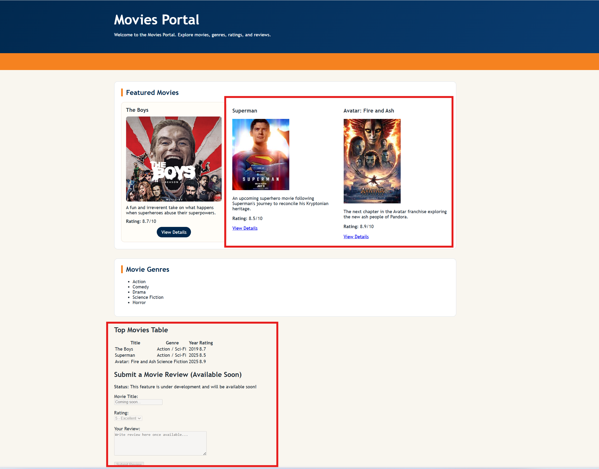

# CPSC-349 Lab 2: Styling My Favorite Movies Portal

## Overview

In Lab 2, the focus moves from HTML structure to CSS styling. While HTML defines the content and structure of a webpage, CSS (Cascading Style Sheets) controls how that content looks and is presented to users.

Think of a website like a restaurant:

- HTML is the building itself, including the walls, tables, kitchen, and menu.
- CSS is the interior design, including the paint colors, lighting, decorations, and overall appearance.

Without CSS, a webpage still functions, but it looks plain, uninteresting, and difficult to navigate. CSS helps create visually appealing, organized, and user-friendly experiences.

In this lab, you will style the existing Movies Portal using a CSUF-inspired color theme and complete missing style connections between the HTML and CSS files.

This lab practices core CSS ideas:

1. Selectors (element, class, and id)
2. The Box Model (margin, border, and padding)
3. Typography and color
4. Layout with Flexbox and Grid
5. Basic visual polish using buttons, forms, tables, and cards

The objective is to make the page look complete, consistent, and readable while keeping the class structure simple for beginners.
---

## Getting Started

1. Open the project in VS Code.
2. Open [index.html](index.html) in a browser.
3. Keep [index.html](index.html) and [styles.css](styles.css) side by side while working.
4. Save your files and refresh the browser to check changes.

Reference screenshot:

---

## Lab 2 Tasks

Complete all of the following:

1. Fix Missing Styles
   Add or correct missing ids/classes in [index.html](index.html) highlighted from the screenshot above. Make sure existing rules in [styles.css](styles.css) apply correctly.
   At minimum, ensure the main content sections, movie cards, table, and review section are styled.

2. Decorate the Rest of the Page
   Finish styling any remaining plain areas so the page has a consistent CSUF visual style.
   Include polished styling for:
   Header and nav
   Movie card layout
   Table appearance
   Form controls and button states
   Footer

3. Keep Animation Limited to Movie Cards
   Use hover/transition effects only on movie cards.
   Do not add animation effects to the summary table. The table enhancements are reserved for a future exercise.

4. Apply the Same CSS Improvements to Your Personalized Lab 1 Page
   Take the final styling approach from this lab and bring it into your personalized Movies Portal from Lab 1.
   This means your Lab 1 personalized page should use the same visual system (theme colors, section styling, card styling, and form/table polish).

---

## Suggested Workflow

1. Start by comparing [index.html](index.html) and [styles.css](styles.css) to find mismatches (missing classes or ids).
2. Fix selector connections first so styles appear immediately.
3. Then refine spacing, typography, and colors for consistency.
4. Confirm movie-card animation works and table animation is not added.
5. Transfer the final CSS approach to your personalized Lab 1 page.

---

## Submission Requirements

Students must submit:

1. Updated Lab 2 repository with completed [index.html](index.html), [styles.css](styles.css), and [README.md](README.md)
2. A screenshot of the final styled Lab 2 page (replace placeholder image if needed)
3. Evidence that the same styling approach was applied to the personalized Lab 1 page

Optional note in your README:
Briefly describe what missing styles you fixed and what you transferred to Lab 1.

---